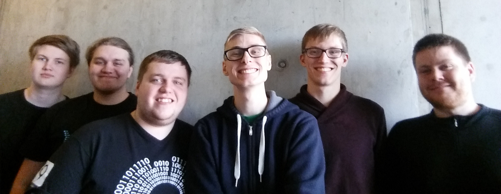

Stofnfundur félagsins var haldinn í dag, 25. mars 2017, í Háskólanum í Reykjavík. Lög voru samin og eftirfarandi stjórn kosin:

- Bjarki Ágúst Guðmundsson, formaður
- Arnar Bjarni Arnarson, meðstjórnandi
- Unnar Freyr Erlendsson, meðstjórnandi
- Garðar Andri Sigurðsson, varamaður
- Hannes Kristján Hannesson, varamaður
- Hjalti Magnússon, varamaður

<figure>
    
    <figcaption>Frá vinstri: Hannes, Arnar, Unnar, Bjarki, Garðar, Hjalti</figcaption>
</figure>