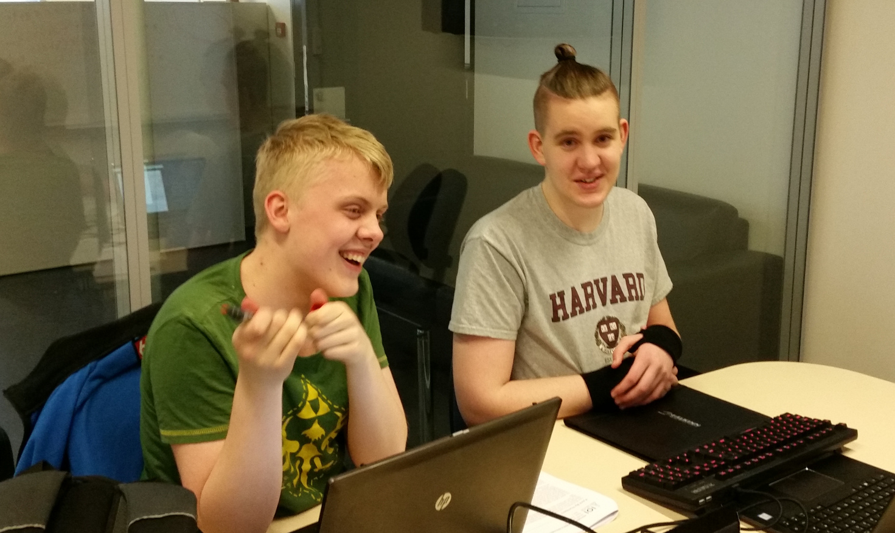
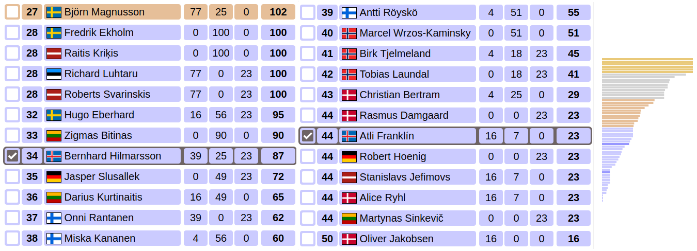
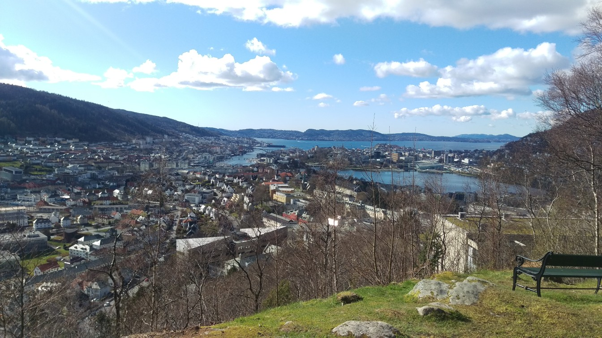
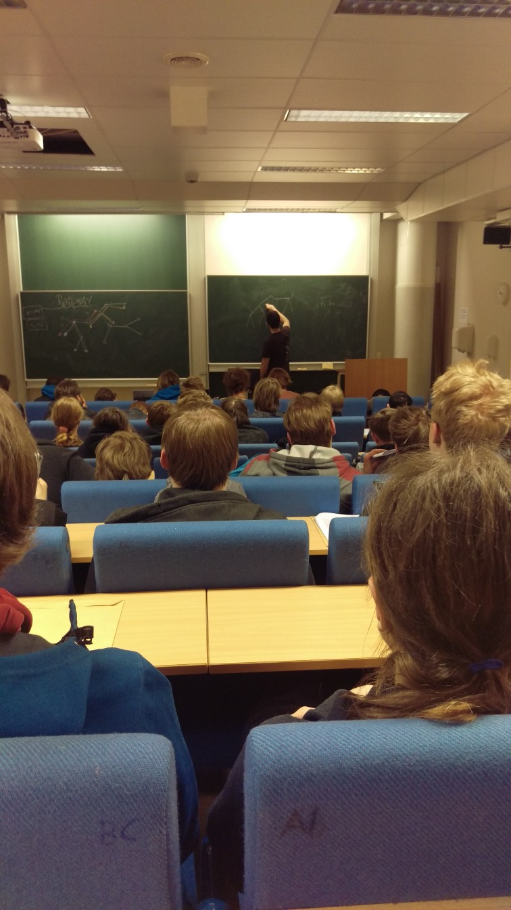
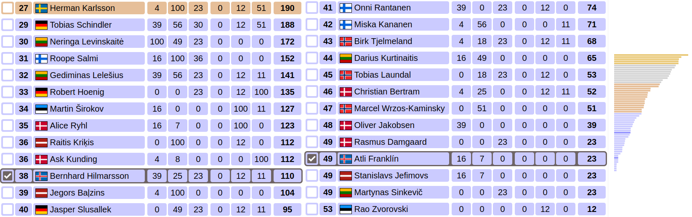

Þeir Atli Fannar Franklín og Bernhard Linn Hilmarsson hafa verið valdir til þess
að taka þátt fyrir hönd Íslands á [Baltnesku Ólympíuleikunum í
forritun](http://www.boi2017.org/) (BOI), sem verða haldnir 25. – 30. apríl í
Björgvin, Noregi. Atli er nemandi í Menntaskólanum á Akureyri en Bernhard er
nemandi í Tækniskólanum. Þeir kepptu báðir í [Forritunarkeppni
framhaldsskólanna](http://forritun.is/) og [Norrænu Ólympíuleikunum í
forritun](http://nordic.progolymp.se/) með góðum árangri. Þar að auki hafa þeir
sýnt mikinn dugnað og áhuga á æfingum hingað til.

<figure>
    
    <figcaption>Atli og Bernhard á æfingu</figcaption>
</figure>

Þetta er í fyrsta skipti sem Ísland tekur þátt á BOI og er þetta hugsað sem
undirbúningur fyrir Alþjóðlegu Ólympíuleikana í forritun, en þeir verða haldnir
í Teheran, Íran í sumar.

Við óskum þeim velgengni í keppninni á sama tíma og við þökkum Íslenskri
erfðagreiningu fyrir styrkinn sem gerir okkur kleift að senda þá út.

#### Dagur 1 – Koma

Drengirnir eru komnir út til Noregs. Á morgun, 26. apríl, verður haldin
undirbúningskeppni, þar sem keppendur fá að kynnast umhverfinu sem verður notað
í alvöru keppnunum tveimur. Keppnin hefst kl. 8:00 að íslenskum tíma, og verður
hægt að fylgjast með henni á
[boi17-public.kattis.com](https://boi17-public.kattis.com/). Eins og sjá má á
stigatöflunni eru 56 keppendur frá Danmörku, Eistlandi, Finnlandi, Þýskalandi,
Íslandi, Lettlandi, Litháen, Noregi, Póllandi og Svíþjóð.

#### Dagur 2 – Undirbúningur

Í morgun var undirbúningskeppnin haldin. Það voru þrjú dæmi, og má nálgast þau á
íslensku
[hér](/boi2017/boi2017_warmup_is.pdf).
Örfáir keppendur leystu öll þrjú dæmin, og um helmingur leysti tvö eða fleiri
dæmi. Okkar menn náðu hvor um sig að leysa eitt dæmi. Þá má nefna að Bernhard
var með fyrstu mönnum að leysa fyrsta dæmið. Báðir töldu þeir sig eiga meira
inni, en á morgun mun fyrsta alvöru keppnin (af tveimur) verða haldin. Eins og
undirbúningskeppnin byrjar hún kl. 8:00 að íslenskum tíma, og verður hægt að
fylgjast með henni á
[boi17-public.kattis.com](https://boi17-public.kattis.com/).

#### Dagur 3 – Fyrri keppnin

Í morgun var fyrsta alvöru keppnin haldin. Það voru þrjú dæmi, og má nálgast þau
á íslensku
[hér](/boi2017/boi2017_day1_is.pdf).
Bernhard byrjaði mjög vel, og þegar tæplega hálftími var liðinn af keppninni var
hann hvorki meira né minna en í 1. sæti. Hann dróst þó rólega aftur úr, en var
fyrstu þrjá og hálfa tímana af keppninni í medalíusæti (efstu ~5 fá gull, næstu
~10 fá silfur, og svo næstu ~14 fá brons). Þegar hálftími var eftir var hann
tveimur sætum frá bronsi, en endaði svo í 34. sæti með 87 stig. Atli átti aðeins
erfiðara með að halda í við skarann, og endaði í 44. sæti með 23 stig.

<figure>
    
    <figcaption>*Staðan hjá okkar mönnum í fyrri keppninni*</figcaption>
</figure>

Frá hinum löndunum má nefna að Pólland var með sterka yfirburði, en fimm af sex
keppendum frá Póllandi leystu öll dæmin upp á 100 stig. Aðeins einn annar
keppandi fékk 100 stig í öllum dæmunum, en það var einn af vinum okkar frá
Svíþjóð.

<figure>
    
    <figcaption>*Sól, blíða, 20. stiga hiti og fallegt útsýni þar sem strákarnir eru, í Björgvin*</figcaption>
</figure>

Okkar menn fá þó annan séns til að komast í medalíusæti, en seinni keppnin er á
morgun. Eins og hinar keppnirnar byrjar hún kl. 8:00 að íslenskum tíma, og
verður hægt að fylgjast með henni á
[boi17-public.kattis.com](https://boi17-public.kattis.com/).

<figure>
    
    <figcaption>*Farið var yfir lausnir á dæmum eftir keppnina*</figcaption>
</figure>

#### Dagur 4 – Seinni keppnin

Í morgun var seinni keppnin haldin. Eins og venjulega voru þrjú dæmi, og má
nálgast þau á íslensku
[hér](/boi2017/boi2017_day2_is.pdf).
Dagurinn í dag virtist vera mun þyngri en dagurinn í gær, og á það sérstaklega
við hjá okkar mönnum. Bernhard nældi sér í örfá stig í tveimur dæmanna, og
endaði með 110 stig í 38. sæti, 80 stigum eða 10 sætum frá bronsmedalíu. Atli
náði engum stigum í dag, og endar því með 23 stigin sem hann hafði náð í fyrri
keppninni, og hafnar þar með í 49. sæti.

<figure>
    
    <figcaption>*Lokastaðan hjá okkar mönnum*</figcaption>
</figure>

Pólverjarnir voru ekki með eins mikla yfirburði í dag, en enduðu engu að síður
með þrjár gullmedalíur. Ein gullmedalía fór svo til Lettlands, en önnur
gullmedalía ásamt fyrsta sæti yfir allt fór svo til vina okkar í Svíþjóð,
nefnilega hans David Wärn. Við óskum þeim öllum innilega til hamingju!

Þetta markar lok Baltnesku Ólympíuleikanna í forritun 2017 í Björgvin, Noregi,
og vonum við að þetta hafi verið góð æfing fyrir strákana. Næst verður stefnan
sett á Alþjóðlegu Ólympíuleikana í forritun, en þeir verða haldnir í Teheran,
Íran í lok sumars 2017. Þar mun Bernhard Linn Hilmarsson taka þátt fyrir hönd
Íslands.
