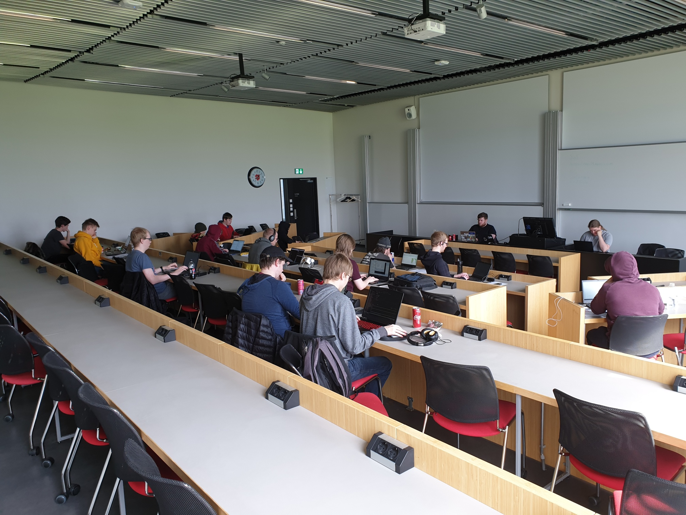

Þann 19. maí var Vorkeppni HR í forritun haldin í Háskólanum í Reykjavík.
Keppnin er einstaklingskeppni, en að þessu sinni tóku 14 keppendur þátt.
Bernhard Linn Hilmarsson bar sigur úr býtum með öll 8 dæmin leyst. Í öðru sæti
var Bjarni Dagur Thor Kárason með 5 dæmi, og rétt á eftir komu þeir Ásþór
Björnsson og Sigurður Helgason með 4 dæmi hvor.

<figure>
    
    <figcaption>Keppnin var æsispennandi</figcaption>
</figure>

## Efni

- Dæmalýsingar ([PDF](/rupc2019/rupc2019.pdf), [Kattis](https://rupc19.kattis.com/problems))
- Lausnarglærur ([PDF](/rupc2019/rupc2019slides.pdf))
- Lýsingar, lausnir og prófunartilvik ([zip](https://github.com/keppnisforritun/keppnir/tree/main/rupc/2019))
- Heildarniðurstöður ([Kattis](https://rupc19.kattis.com/standings), [HTML](/rupc2019/rupc19-standings.html))
