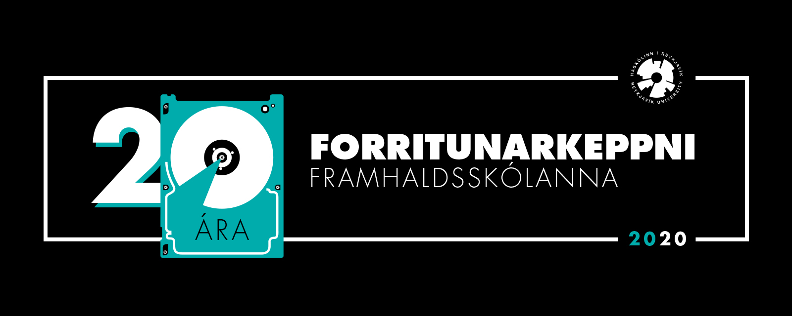

<figure>
    
</figure>

Í ár fór keppnin fram á netinu vegna samkomubanns. Þátttaka var engu að síðu
mjög góð, og keppnin æsispennandi! Keppendur nýttu sér tæknina, settu upp
fjarfundi með liðsfélögum, og spjölluðu í gegnum netið. Það myndaðist rosalega
skemmtileg stemning þrátt fyrir þetta óhefðbundna fyrirkomulag.

## Efni

- Dæmalýsingar 
    - Alfa ([Kattis](https://iceland-alfa20.kattis.com/problems))
    - Beta ([Kattis](https://iceland-beta20.kattis.com/problems))
    - Delta ([Kattis](https://iceland-delta20.kattis.com/problems))
- Lausnarglærur ([PDF](/fk2020/fk_2020_solution_slides.pdf))
- Lýsingar, lausnir og prófunartilvik ([GitHub](https://github.com/ForritunarkeppniFramhaldsskolanna/Keppnir/tree/master/2020))
- Heildarniðurstöður 
    - Alfa ([Kattis](https://iceland-alfa20.kattis.com/standings), [HTML](/fk2020/alfa2020.html))
    - Beta ([Kattis](https://iceland-beta20.kattis.com/standings), [HTML](/fk2020/beta2020.html))
    - Delta ([Kattis](https://iceland-delta20.kattis.com/standings), [HTML](/fk2020/delta2020.html))
    - Opin deild ([Kattis](https://iceland.kattis.com/contests/fk2020open), [HTML](/fk2020/open2020.html))
