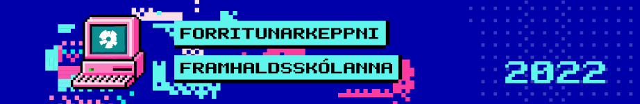

<figure>
  
</figure>

Eftir tvö ár á netinu fór keppnin loksins fram aftur í Háskólanum í Reykjavík.

## Efni

- Dæmalýsingar 
    - Alfa ([fyrir hádegi](https://github.com/ForritunarkeppniFramhaldsskolanna/Keppnir/blob/master/2022/pdf/fk_2022_alfa_fyrir.pdf), [eftir hádegi](https://github.com/ForritunarkeppniFramhaldsskolanna/Keppnir/blob/master/2022/pdf/fk_2022_alfa_eftir.pdf))
    - Beta ([fyrir hádegi](https://github.com/ForritunarkeppniFramhaldsskolanna/Keppnir/blob/master/2022/pdf/fk_2022_beta_fyrir.pdf), [eftir hádegi](https://github.com/ForritunarkeppniFramhaldsskolanna/Keppnir/blob/master/2022/pdf/fk_2022_beta_eftir.pdf))
    - Delta ([fyrir hádegi](https://github.com/ForritunarkeppniFramhaldsskolanna/Keppnir/blob/master/2022/pdf/fk_2022_delta_fyrir.pdf), [eftir hádegi](https://github.com/ForritunarkeppniFramhaldsskolanna/Keppnir/blob/master/2022/pdf/fk_2022_delta_eftir.pdf))
- Lausnarglærur ([PDF](https://github.com/ForritunarkeppniFramhaldsskolanna/Keppnir/blob/master/2022/pdf/fk_2022_solution_slides.pdf))
- Lýsingar, lausnir og prófunartilvik ([GitHub](https://github.com/ForritunarkeppniFramhaldsskolanna/Keppnir/tree/master/2022))
- Heildarniðurstöður 
    - Alfa ([HTML](/fk2022/alfa2022/index.html))
    - Beta ([HTML](/fk2022/beta2022/index.html))
    - Delta ([HTML](/fk2022/delta2022/index.html))
