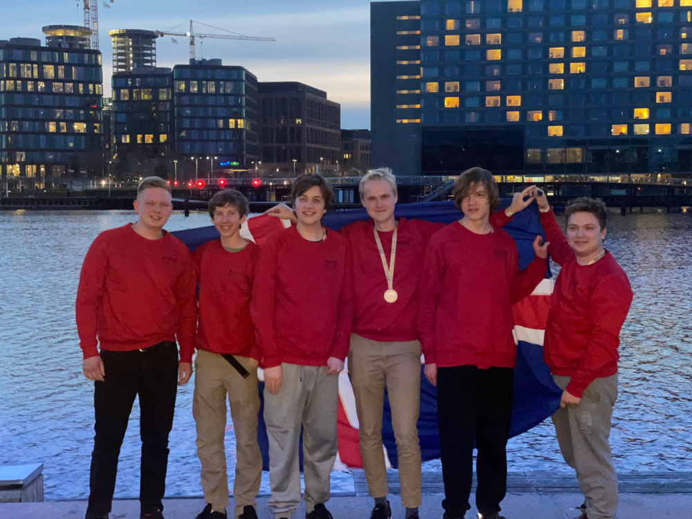

BOI (Baltic Olympiad in Informatics) 2023 var haldið 28. apríl til 2. maí 2023 í Lyngby, Danmörku.

Framhaldsskólanemarnir sem kepptu fyrir hönd Íslands voru:
- Benedikt Vilji Magnússon, MR
- Kirill Zolotuskiy, MR
- Kristinn Hrafn Daníelsson, Tækniskólinn
- Kristófer Helgi Antonsson, Tækniskólinn
- Róbert Kristian Freysson, MR
- Þórhallur Tryggvason, Tækniskólinn

Arnar Bjarni Arnarson, liðsstjóri, og Samúel Arnar Hafsteinsson, aðstoðarliðsstjóri, fylgdu nemendunum á keppnina.

Benedikt Vilji fékk 311 stig og fékk því silfur medallíu.
Kirill fékk heiðurs ummæli, sem þýðir að hann hefði lent í medallíu sæti ef einungis væri miðað við fyrri dag keppninnar.

Eftir keppnina fengu keppendur að fara í Tívóli og bátsferð um síki Kaupmannahafnar.

<figure>
    
    <figcaption>Frá vinstri: Kristófer Helgi, Kristinn Hrafn, Þórhallur, Benedikt Vilji, Róbert Kristian, Kirill</figcaption>
</figure>

[Heimasíða BOI 2023](https://boi2023.org)
