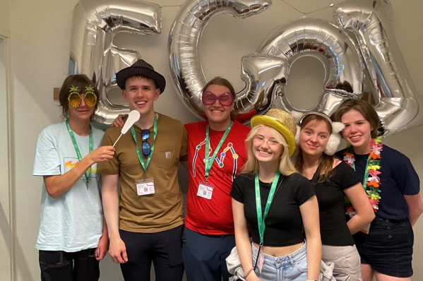

Keppnin EGOI (European Girls' Olympiad in Informatics) 2023 var haldin 15. - 21. júlí 2023 í Lund, Svíþjóð.

Í ár tók Ísland þátt í keppninni í fyrsta sinn.
Keppnisforritunarfélag íslands hafði samband við framhaldsskólanna á Íslandi í leit að áhugasömum stelpum í byrjun maí.

Framhaldsskólanemarnir sem kepptu fyrir hönd Íslands voru:
- Eva Natalía Elvarsdóttir, MA
- Eva Sóllilja Einarsdóttir, FB
- Frigg Einarsdóttir, MH
- Sólbjört Tinna Cornette, MA

Arnar Bjarni Arnarson, liðsstjóri, og Samúel Arnar Hafsteinsson, aðstoðarliðsstjóri, fylgdu nemendunum á keppnina.

Eva Sóllilja náði flestum stigum af íslensku keppendunum, 106 stig samtals.

Milli keppnisdaga fóru keppendur í dýragarðinn Skåne Djurpark og þaðan á ströndina Lomma þar sem grillveisla var haldin.
Stelpurnar eignuðust vini frá öðrum löndum og tóku einnig þátt í alls konar skemmtunum eins og borðspilum, karaoke, þrautum og partí eftir lokaathöfnina.

<figure>
    
    <figcaption>Frá vinstri: Frigg, Samúel Arnar, Arnar Bjarni, Eva Natalía, Sólbjört Tinna, Eva Sóllilja</figcaption>
</figure>

[Heimasíða EGOI 2023](https://egoi23.se)
[Stigatafla](https://egoi23.se/scoreboard)
[Verkefni](https://open.kattis.com/problem-sources/European%20Girls%27%20Olympiad%20in%20Informatics%202023)
