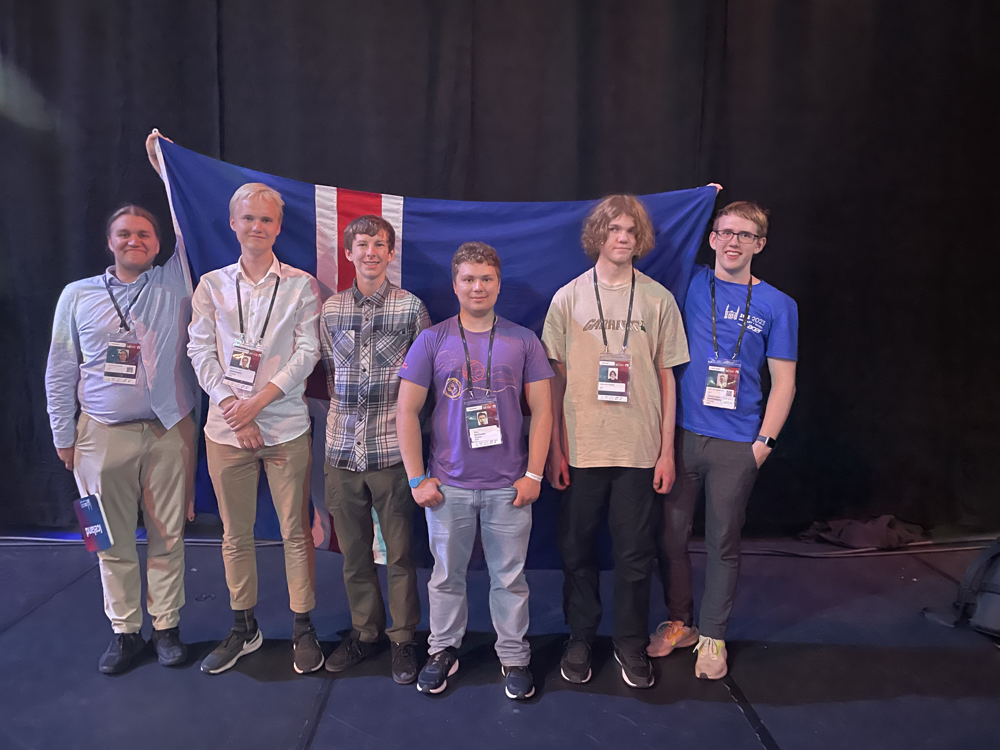

Keppnin IOI (International Olympiad in Informatics) 2023 var haldin 28. ágúst - 04. september 2023 í Szeged, Ungverjalandi.

Í ár tók Ísland þátt með fullu fjögurra manna liði í fyrsta sinn.
Keppnisforritunarfélag Íslands hélt æfingar hverja helgi með keppendunum, en voru þær þó opnar öllum áhugasömum nemendum

Framhaldsskólanemarnir sem kepptu fyrir hönd Íslands voru:
- Benedikt Vilji Magnússon, MR
- Kirill Zolotuskiy, MR
- Kristinn Hrafn Daníelsson, Tækniskólinn
- Róbert Kristian Freysson, MR

Arnar Bjarni Arnarson, liðsstjóri, og Samúel Arnar Hafsteinsson, aðstoðarliðsstjóri, fylgdu nemendunum á keppnina.

Benedikt Vilji náði flestum stigum af íslensku keppendunum, 141 stig samtals, og fékk hann heiðurs ummæli, en var aðeins undir mörkunum fyrir brons medalíu.

Keppendum var boðið í dýragarð og að skoða bæinn Ópusztaszer þar sem mátti kynnast sögu Ungverjalands og sjá hæfileikaríka
hestreiðamenn sem sýndu hvernig vopn voru notuð á hestbaki fyrr á tíð.
Einnig fóru keppendur í skemmtigarð þar sem alls konar afþreyingar voru í boði eins og klifur, laser tag, trampólín og fleira!

<figure>
    
    <figcaption>Frá vinstri: Arnar Bjarni, Benedikt Vilji, Kristinn Hrafn, Kirill, Róbert Kristian, Samúel Arnar</figcaption>
</figure>

Hlekkir:
- [Heimasíða IOI 2023](https://ioi2023.hu)
- [Stigatafla](https://ioi-2023.github.io/)
- [Verkefni](https://ioi2023.hu/tasks/)
