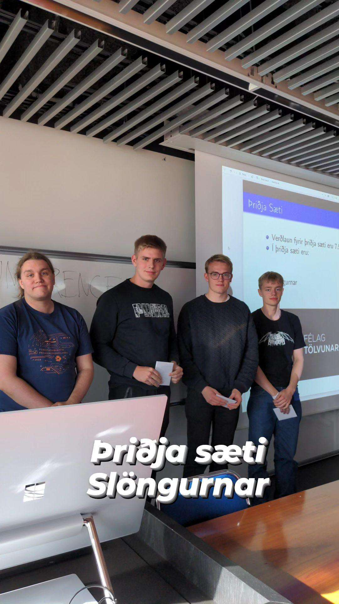
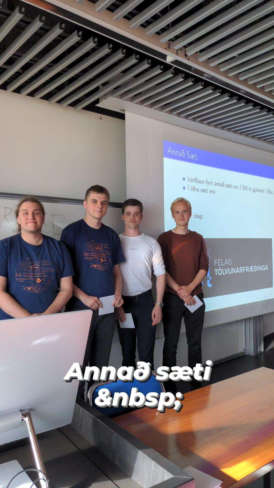
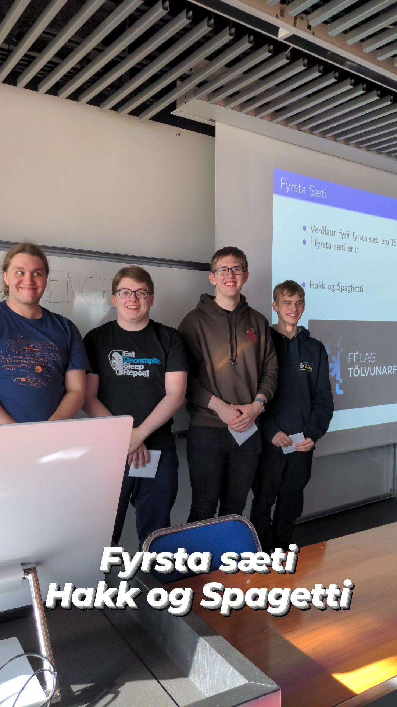

### Atburðurinn

Forritunarkeppni Háskólanna á Íslandi var haldin í fyrsta sinn þann 9. september árið 2023.
Hún var haldin í Háskólanum í Reykjavík í stofu M201.
Þar gátu nemendur myndað allt að þriggja manna lið og reynt við forritunarverkefnin.

Samtals 24 lið skráðu sig í keppnina.
- Nemendur úr Háskólanum í Reykjavík mynduðu 11 lið.
- Nemendur úr Háskóla Íslands mynduðu 8 lið.
- Nemendur úr framhaldsskólum mynduðu 3 lið.

Í keppninni reyndu liðin við 10 verkefni sem voru miserfið.
Hvert verkefni sem lið leysti veitti þeim eitt stig og eina blöðru, en blöðrur eru gömul hefð í háskólakeppnum í forritun.

Í þriðja sæti var liðið Slöngurnar frá Háskóla Íslands.
Meðlimir liðsins voru Kristján Sölvi Örnólfsson, Hallgrímur Haraldsson og Viktor Már Guðmundsson.
Þeir fengu 7,500 krónu gjafabréf í ELKO í verðlaun.

<figure>
    
    <figcaption>Frá vinstri: Arnar Bjarni, Hallgrímur, Viktor Már, Kristján Sölvi</figcaption>
</figure>

Í öðru sæti var liðið &nbsp; frá Háskóla Íslands.
Meðlimir liðsins voru Benedikt Vilji Magnússon, Einar Andri Víðisson og Matthías Andri Hrafnkelsson
Þeir fengu 7,500 krónu gjafabréf í ELKO í verðlaun.
<figure>
    
    <figcaption>Frá vinstri: Arnar Bjarni, Matthías Andri, Einar Andri, Benedikt Vilji</figcaption>
</figure>

Í fyrsta sæti var liðið Hakk og Spaghetti frá Háskólanum í Reykjavík.
Meðlimir liðsins voru Dagur Benjamínsson, Elvar Árni Bjarnason og Samúel Arnar Hafsteinsson.
Þeir fengu 15,000 krónu gjafabréf í ELKO í verðlaun.

<figure>
    
    <figcaption>Frá vinstri: Arnar Bjarni, Dagur, Samúel Arnar, Elvar Árni</figcaption>
</figure>

Næst á dagskrá er Norðurlandakeppnin NCPC sem verður haldin í Háskóla Íslands þann 7. október.
Nánari upplýsingar um hana má finna [hér](https://nordic.icpc.io/ncpc2023/).

---

### Hlekkir

- [Stigatafla](https://fkhi.kattis.com/https://fkhi.kattis.com/contests/fkhi23/standings/)
- [Verkefni](https://open.kattis.com/problem-sources/Forritunarkeppni%20H%C3%A1sk%C3%B3lanna%20%C3%A1%20%C3%8Dslandi%202023)
- [Keppnisgögn](https://github.com/keppnisforritun/keppnir/tree/main/fkhi/2023)

---

### Viðurkenningar

Arnar Bjarni Arnarson sá um skipulag keppninnar.

Dómnefnd keppninnar skipuðu:
- Arnar Bjarni Arnarson
- Atli Fannar Franklín

Höfundar verkefnanna voru:
- Arnar Bjarni Arnarson
- Atli Fannar Franklín
- Magni Steinn Þorbjörnsson
- Unnar Freyr Erlendsson

Sérstakar þakkir:
- [Félag Tölvunarfræðinga](https://ft.is), fyrir að veita verðlaunin
- Háskólinn í Reykjavík, fyrir að veita húsnæði og fjármagn
- Kattis, fyrir að hýsa keppnina í kerfinu sínu
- Bernhard Linn Hilmarson, fyrir að prófa verkefnin og aðstoða á meðan keppnin stóð yfir
- Bjarki Ágúst Guðmundsson, fyrir að aðstoða á meðan keppnin stóð yfir
- David Rasmussen Lolck, fyrir að prófa verkefnin
- Gunnlaugur Arnarson, fyrir aðstoð við undirbúning blaðranna og veitinganna
- Henning Úlfarsson, fyrir að vera tengiliður okkar í Háskólanum í Reykjavík
- Ólafur Jónsson, fyrir að vera tengiliður okkar í Háskólanum á Akureyri
- Steinn Guðmundsson, fyrir að vera tengiliður okkar í Háskóla Íslands
- Unnar Freyr Erlendsson, fyrir að prófa verkefnin, sjá um Instagram og aðstoða á meðan keppnin stóð yfir
- Örn Gunnlaugsson, fyrir aðstoð við undirbúning blaðranna og veitinganna
