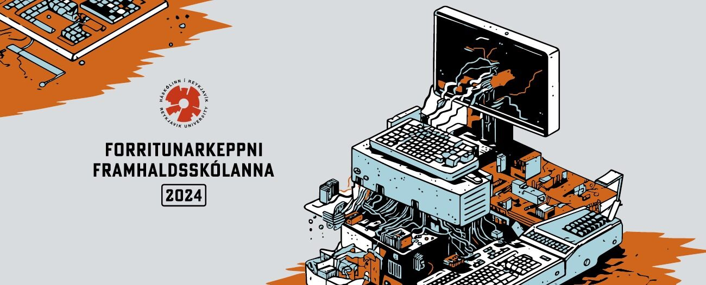

<figure>
  
</figure>

## Efni

- Dæmalýsingar 
    - Alfa ([fyrir hádegi](https://github.com/ForritunarkeppniFramhaldsskolanna/Keppnir/blob/master/2024/pdf/fk_2024_alfa_fyrir.pdf), [eftir hádegi](https://github.com/ForritunarkeppniFramhaldsskolanna/Keppnir/blob/master/2024/pdf/fk_2024_alfa_eftir.pdf))
    - Beta ([fyrir hádegi](https://github.com/ForritunarkeppniFramhaldsskolanna/Keppnir/blob/master/2024/pdf/fk_2024_beta_fyrir.pdf), [eftir hádegi](https://github.com/ForritunarkeppniFramhaldsskolanna/Keppnir/blob/master/2024/pdf/fk_2024_beta_eftir.pdf))
    - Delta ([fyrir hádegi](https://github.com/ForritunarkeppniFramhaldsskolanna/Keppnir/blob/master/2024/pdf/fk_2024_delta_fyrir.pdf), [eftir hádegi](https://github.com/ForritunarkeppniFramhaldsskolanna/Keppnir/blob/master/2024/pdf/fk_2024_delta_eftir.pdf))
- Lausnarglærur ([PDF](https://github.com/ForritunarkeppniFramhaldsskolanna/Keppnir/blob/master/2024/pdf/fk_2024_solution_slides.pdf))
- Lýsingar, lausnir og prófunartilvik ([GitHub](https://github.com/ForritunarkeppniFramhaldsskolanna/Keppnir/tree/master/2024))
- Heildarniðurstöður 
    - Alfa ([HTML](https://iceland-fk24.kattis.com/contests/fk2024alfa/standings))
    - Beta ([HTML](https://iceland-fk24.kattis.com/contests/fk2024beta/standings))
    - Delta ([HTML](https://iceland-fk24.kattis.com/contests/fk2024delta/standings))
