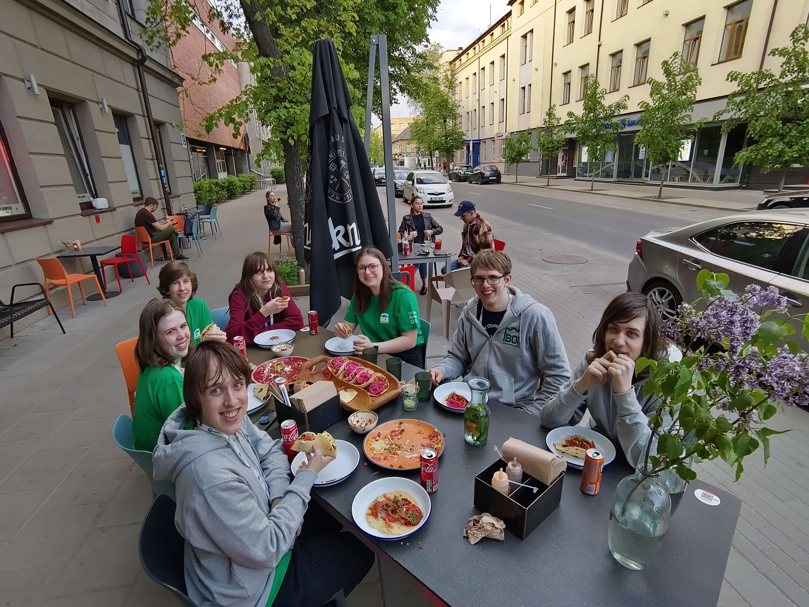

BOI (Baltic Olympiad in Informatics) 2024 var haldið 3. maí til 7. maí 2024 í Vilnius, Litháen.

Nemendurnir sem kepptu fyrir hönd Íslands voru:
- Eva Sóllilja Einarsdóttir, FB
- Frigg Einarsdóttir, MH
- Gunnsteinn Þór Ólason, Breiðholtsskóli
- Kristinn Hrafn Daníelsson, Tækniskólinn
- Moira Alicia Harté, MA
- Þórhallur Tryggvason, Tækniskólinn

Arnar Bjarni Arnarson, liðsstjóri, og Samúel Arnar Hafsteinsson, aðstoðarliðsstjóri, fylgdu nemendunum á keppnina.

Þórhallur Tryggvason var hæstur íslenskra keppenda með 50 stig.

Keppendur fóru á tæknisafn og sáu lasersýningu, þar sem var spilað tónlist með Tesla spólum.
Seinna heimsóttu keppendur Trakai kastala og fóru í bátsferð.

<figure>
    
    <figcaption>Frá vinstri: Samúel Arnar, Frigg, Gunnsteinn Þór, Kristinn Hrafn, Þórhallur, Eva Sóllilja, Moira, Arnar Bjarni</figcaption>
</figure>

<figure>
    
</figure>

[Heimasíða BOI 2024](https://boi2024.lmio.lt)
