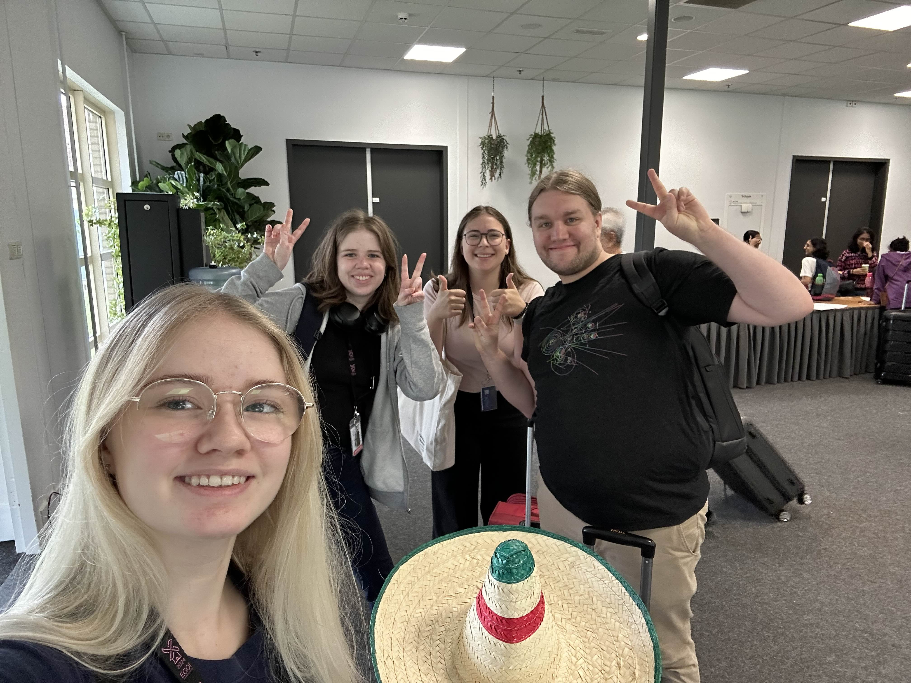
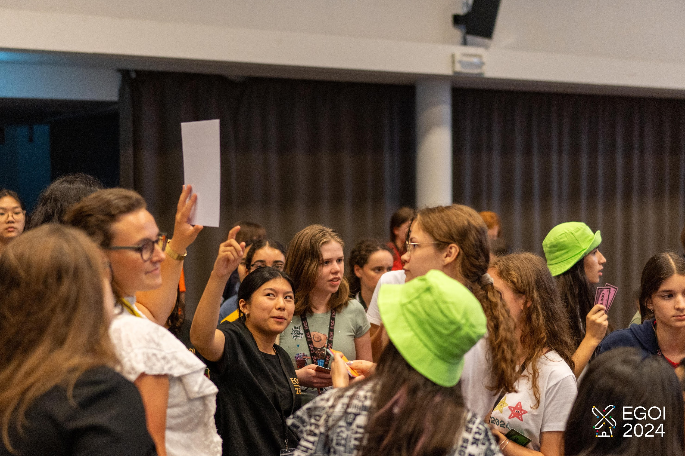
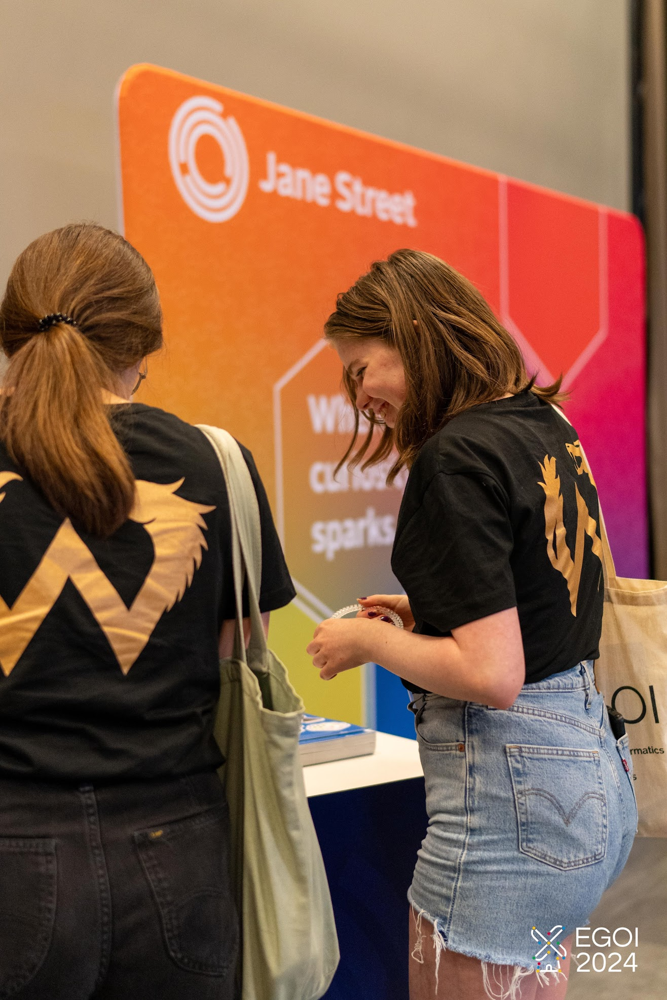
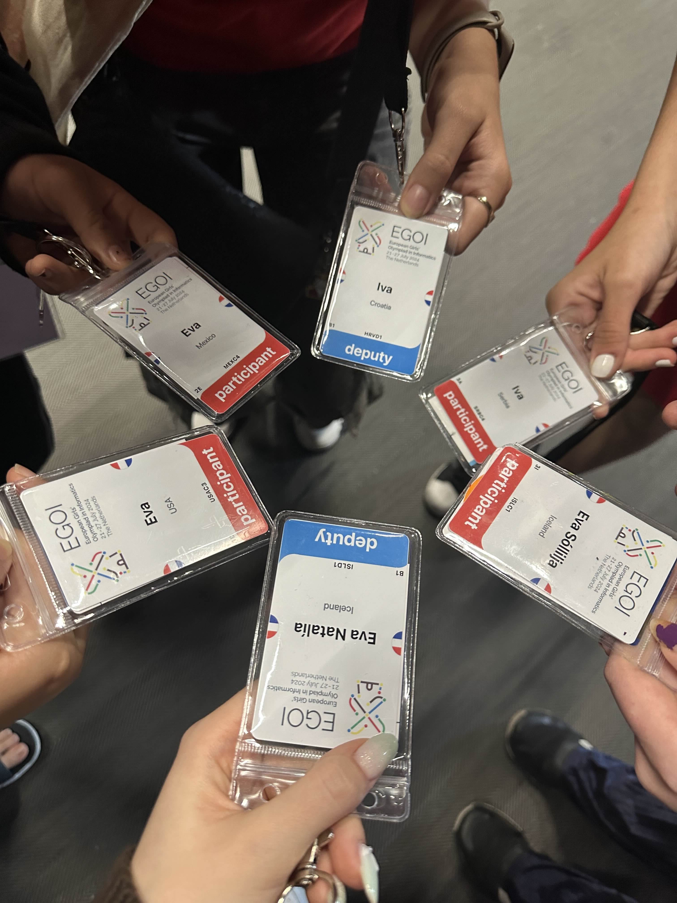
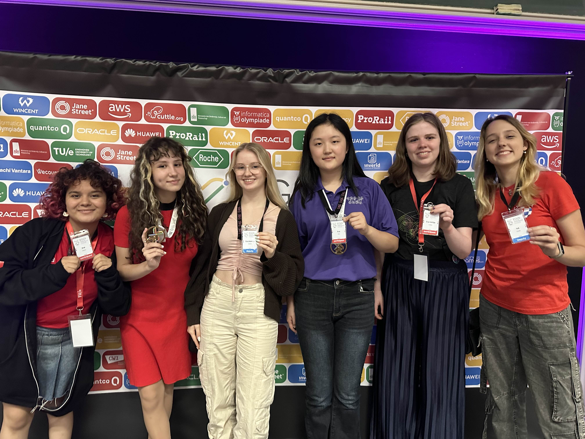

Keppnin EGOI (European Girls' Olympiad in Informatics) 2023 var haldin 21. - 27. júlí 2024 í Veldhoven, Hollandi.

Í ár tók Ísland þátt í keppninni í annað sinn.
Keppnisforritunarfélag Íslands hafði samband við framhaldsskólanna á Íslandi í leit að áhugasömum stelpum í byrjun maí.
Einnig bauð félagið stelpunum sem tóku þátt í Forritunarkeppni Framhaldsskóla.

Framhaldsskólanemarnir sem kepptu fyrir hönd Íslands voru:
- Eva Sóllilja Einarsdóttir, FB
- Moira Alicia Harté, MA

Arnar Bjarni Arnarson, liðsstjóri, ásamt Evu Natalíu Elvarsdóttir, aðstoðarliðsstjóri og keppanda síðasta árs, fylgdi nemendunum á keppnina.

Eva Sóllilja náði 150 stigum og Moira náði 74 stigum af 600 samtals.

Milli keppnisdaga fóru keppendur og liðsstjórar til Nuenen og skoðuðu Vincent van Gogh safnið.
Stelpurnar eignuðust vini frá öðrum löndum og tóku einnig þátt í alls konar skemmtunum eins og borðspilum, söng, þrautum og partí.

<figure>
    
    <figcaption>Frá vinstri: Eva Natalía, Eva Sóllilja, Moira, Arnar Bjarni</figcaption>
</figure>

<figure>
    
    <figcaption>Eva Sóllilja að vinna með hóp sínum í fjármálaþraut sem var gefin</figcaption>
</figure>

<figure>
    
    <figcaption>Eva Sóllilja og Moira að skoða básinn hjá styrktaraðilanum Jane Street</figcaption>
</figure>

<figure>
    
    <figcaption>Komist var að því að það væru sex mættar á atburðinn að nafni Eva/Iva</figcaption>
</figure>

<figure>
    
    <figcaption>Allar Evur og Ivur saman</figcaption>
</figure>

Hlekkir:
- [Heimasíða EGOI 2024](https://wiki.egoi2024.nl)
- [Stigatafla](https://stats.egoi.org/editions/2024/results/)
- [Verkefni](https://open.kattis.com/problem-sources/European%20Girls%27%20Olympiad%20in%20Informatics%202024)
