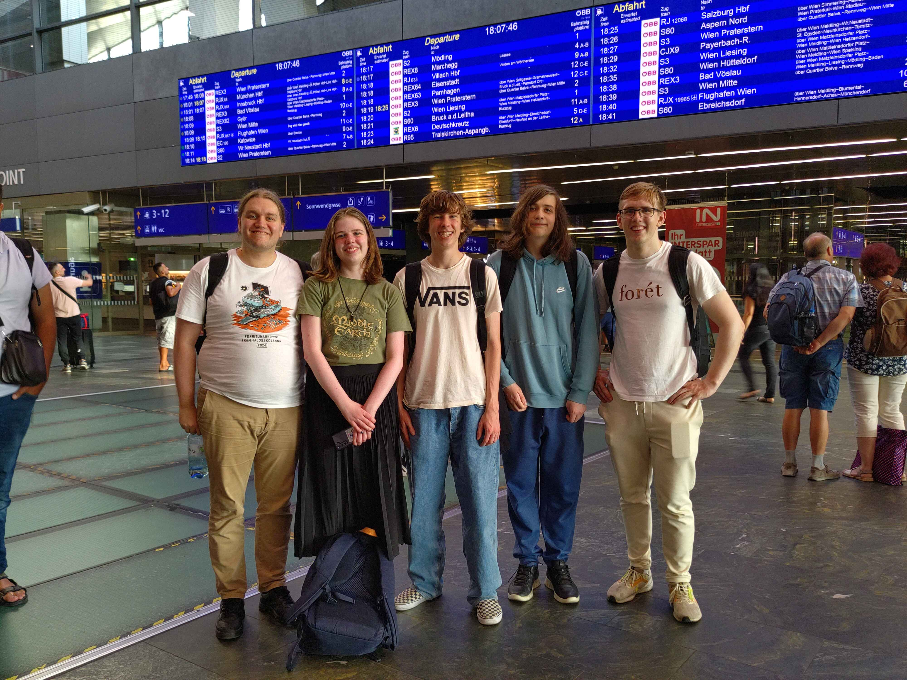
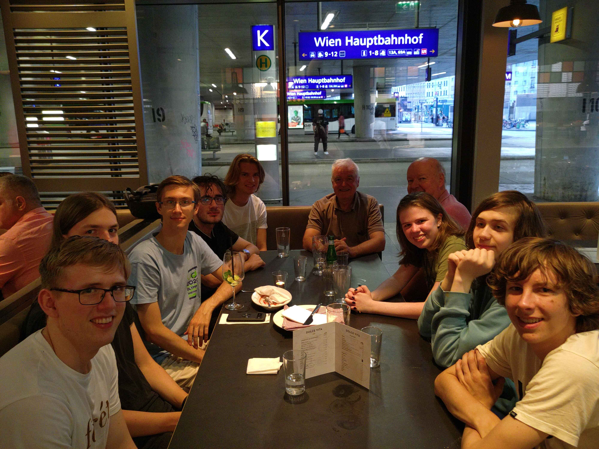
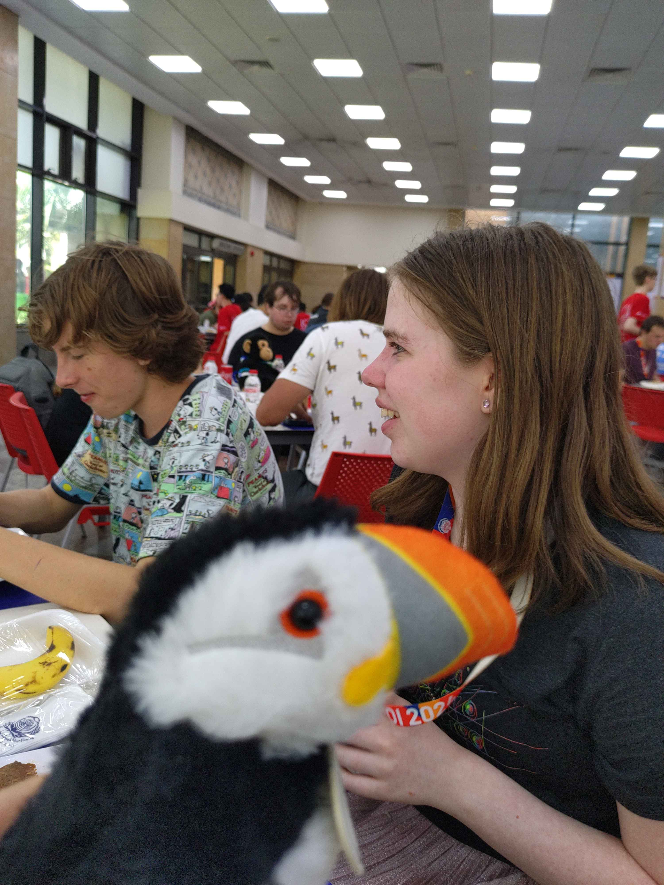
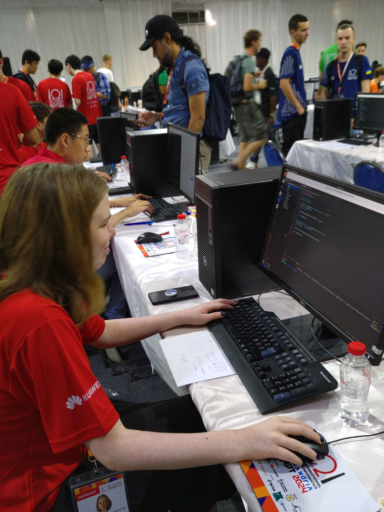
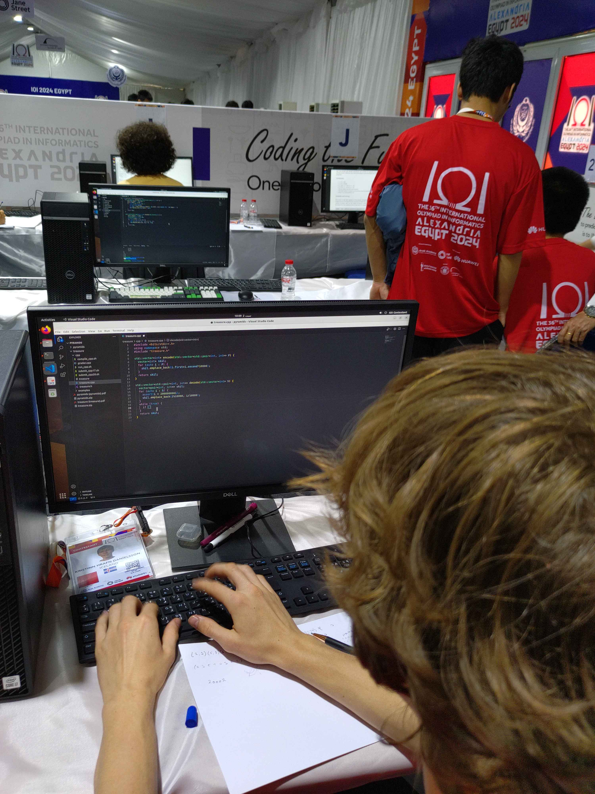
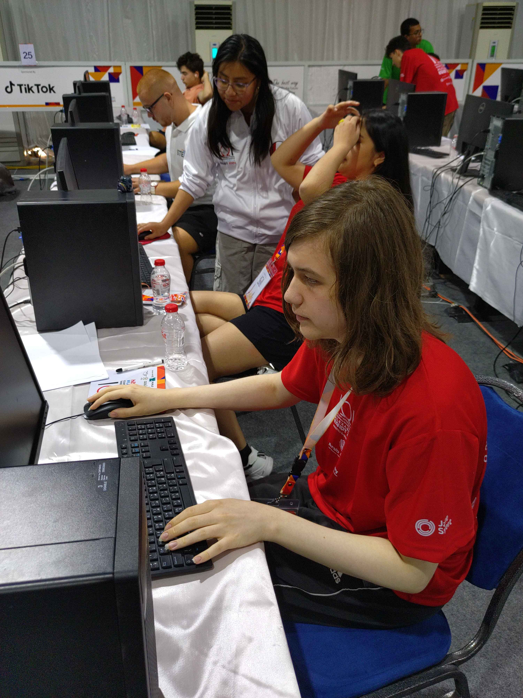
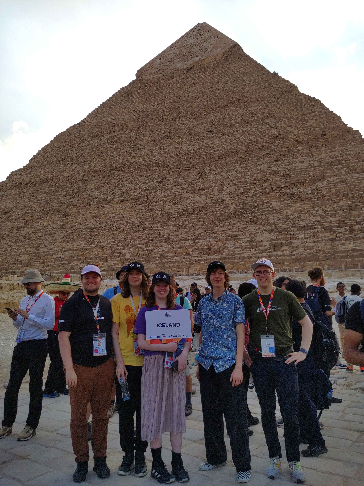
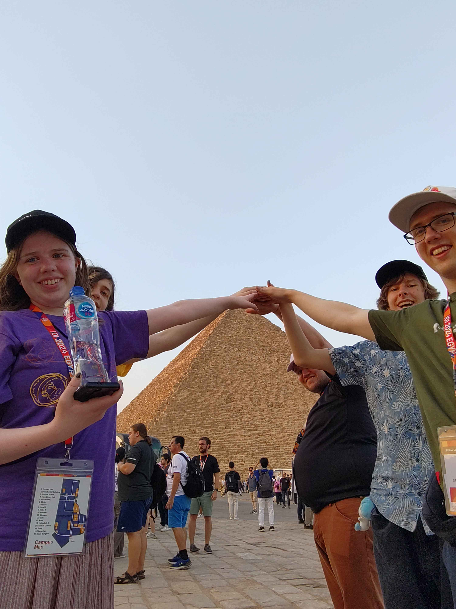
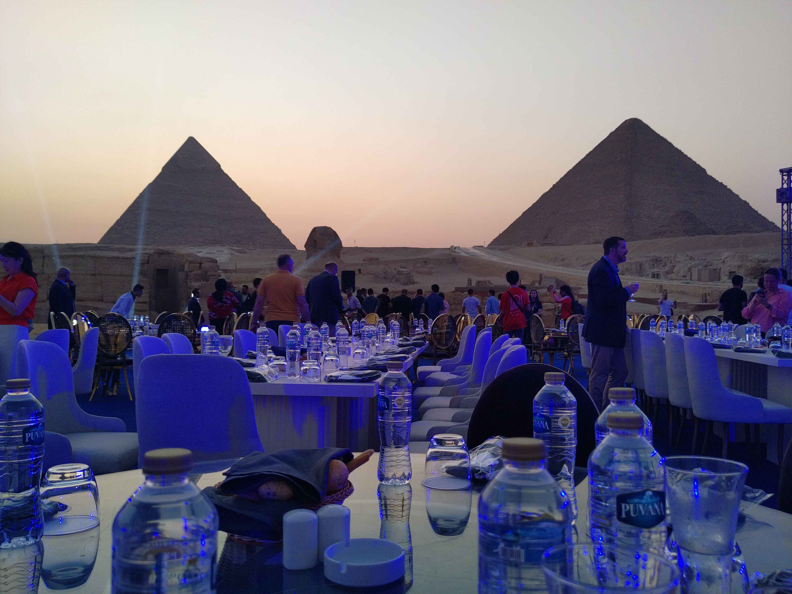

Keppnin IOI (International Olympiad in Informatics) 2024 var haldin 01. september - 08. september 2024 í Alexandríu, Egyptalandi.

Í ár tóku þrír íslenskur framhaldsskólanemar þátt í keppninni.
Keppnisforritunarfélag Íslands hélt æfingar hverja helgi með keppendunum, en voru þær þó opnar öllum áhugasömum nemendum.

Áður en farið var til Egyptalands, heimsóttu keppendur okkar Vín í Austurríki þar sem þeir tóku þátt í æfingabúðum með liðinu frá Austurríki.
Við erum mjög þakklát fyrir boðið frá Austurríska ólympíuliðinu um að æfa með þeim.

Framhaldsskólanemarnir sem kepptu fyrir hönd Íslands voru:
- Eva Sóllilja Einarsdóttir, FB
- Kristinn Hrafn Daníelsson, Tækniskólinn
- Þórhallur Tryggvason, Tækniskólinn

Arnar Bjarni Arnarson, liðsstjóri, og Samúel Arnar Hafsteinsson, aðstoðarliðsstjóri, fylgdu nemendunum á keppnina.

Kristinn Hrafn náði flestum stigum af íslensku keppendunum, 115.50 stig samtals.
Eva fékk 93.31 og Þórhallur fékk 76.35.

Keppendum var boðið á nýja bókasafnið í Alexandríu, á ströndina í Montazah flóa og lokaathöfnin og kvöldverðurinn var haldinn við pýramídana og meyljónið í Giza.
Einnig var mikið af skemmtunum að finna á svæði Arab Academy of Science, Technology and Maritime Transport þar sem keppendur og leiðtogar gistu.

<figure>
    
    <figcaption>Frá vinstri: Arnar Bjarni, Eva Sóllilja, Kristinn Hrafn, Þórhallur, Samúel Arnar</figcaption>
</figure>

<figure>
    
    <figcaption>Íslenska og Austurríska liðið saman í Vín</figcaption>
</figure>

<figure>
    
    <figcaption>Stuðningsdýrið okkar með Evu og Kristni í bakgrunni</figcaption>
</figure>

<figure>
    
    <figcaption>Eva Sóllilja að forrita</figcaption>
</figure>

<figure>
    
    <figcaption>Kristinn Hrafn að forrita</figcaption>
</figure>

<figure>
    
    <figcaption>Þórhallur að forrita</figcaption>
</figure>

<figure>
    
    <figcaption>Mætt til Giza</figcaption>
</figure>

<figure>
    
    <figcaption>Klassískt</figcaption>
</figure>

<figure>
    
    <figcaption>Ágætt útsýni við matarborðið</figcaption>
</figure>

<figure>
    
    <figcaption>Farið að rökkva</figcaption>
</figure>

Hlekkir:
- [Heimasíða IOI 2024](https://ioi2024.eg)
- [Stigatafla](https://stats.ioinformatics.org/results/2024)
- [Verkefni](https://www.ioi2024.eg/competition-tasks)
