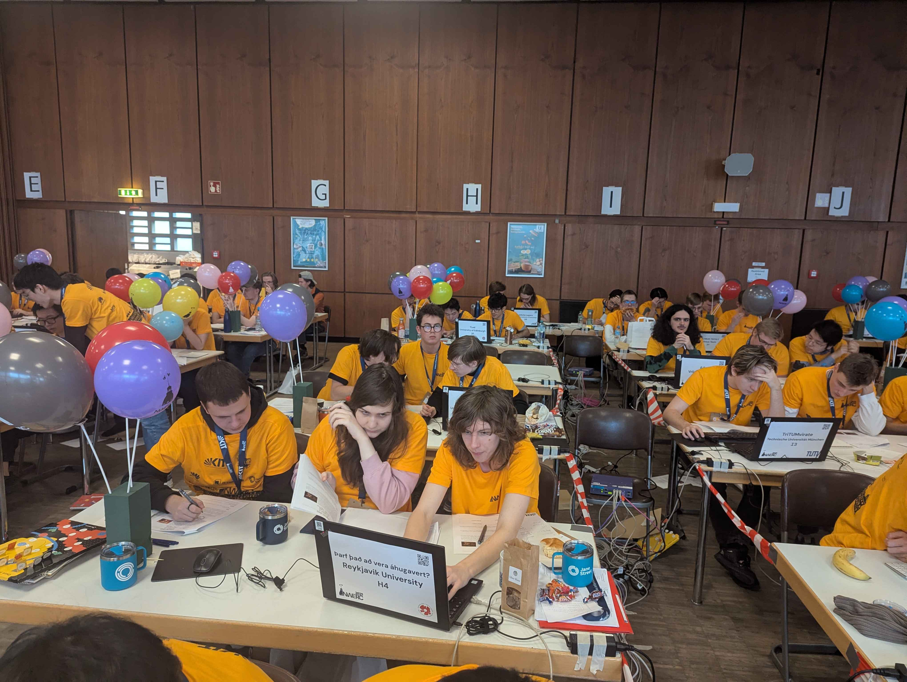
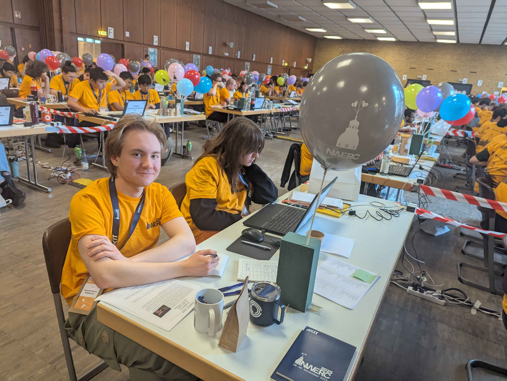
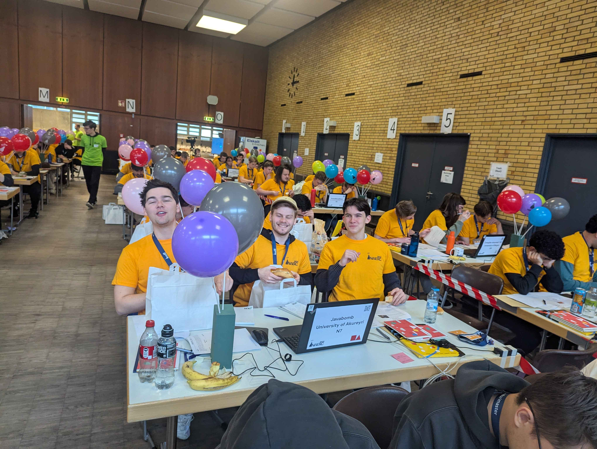

Norðvestur Evrópu háskólakeppnin í forritun var haldin í Karlsruhe 28. - 30. nóvember.
Þrjú lið fóru frá Íslandi þetta ár, eitt frá hverjum háskóla sem kennir tölvunarfræði.
Keppnin er hluti af alþjóðlegu háskólakeppninni ICPC og fara bestu 13 háskólarnir áfram
á Evrópsku Meistarakeppnina (e. European Championship). Einnig tryggja bestu tveir
háskólarnir sér pláss á heimsmeistarakeppnina (e. ICPC World Finals).

Fyrir hönd Háskólans í Reykjavík fóru:
- Aleksa Ilic
- Kristinn Hrafn Daníelsson
- Þórhallur Tryggvason
- Arnar Bjarni Arnarson (þjálfari)

<figure>
    
    <figcaption>Frá vinstri: Aleksa, Þórhallur, Kristinn Hrafn</figcaption>
</figure>

Fyrir hönd Háskóla Íslands fóru:
- Alexander Bjartur Guðbjartsson
- Frigg Einarsdóttir
- Matthías Andri Hrafnkelsson
- Atli Fannar Franklín (þjálfari og dómari)

<figure>
    
    <figcaption>Frá vinstri: Alexander Bjartur, Frigg</figcaption>
</figure>

Fyrir hönd Háskólans á Akureyri fóru:
- Ari Þórðarson
- Guðmundur Jón Bergmannsson
- Jóhann Jörgen Kjerúlf
- Daníel Jóhannsson (þjálfari)

<figure>
    
    <figcaption>Frá vinstri: Ari, Jóhann, Guðmundur</figcaption>
</figure>

Samtals tóku 141 lið frá 75 háskólum þátt í keppninni.
Sigursælasti skólinn var University of Cambridge sem tók fyrsta sætið, en var einnig með lið í 4., 5. og 8. sæti.

Háskóla Íslands vantaði einn keppanda vegna veikinda og endaði í 124. sæti með 3 verkefni leyst af 12 samtals.
Háskólinn á Akureyri leysti 4 verkefni og endaði í 113. sæti.
Háskólinn í Reykjavík stóð sig best af íslensku skólunum með 6 verkefni leyst í 87. sæti.

Meira um keppnina hér:
- [Vefsíða NWERC 2025](https://2025.nwerc.eu/)
- [Stigatöflur](https://judge.2025.nwerc.eu/public)
- [Vefsíða ICPC](https://icpc.global/)

Athugið að hægt er að skipta milli stigatöflu æfingakeppninnar og aðalkeppninnar í efra hægra horni.
