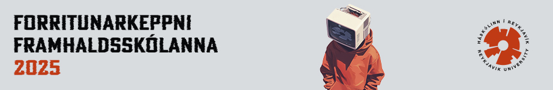

<figure>
  
</figure>

## Efni

- Dæmalýsingar 
    - Alfa ([fyrir hádegi](https://github.com/ForritunarkeppniFramhaldsskolanna/Keppnir/blob/master/2025/pdf/fk_2025_alfa_fyrir.pdf), [eftir hádegi](https://github.com/ForritunarkeppniFramhaldsskolanna/Keppnir/blob/master/2025/pdf/fk_2025_alfa_eftir.pdf))
    - Beta ([fyrir hádegi](https://github.com/ForritunarkeppniFramhaldsskolanna/Keppnir/blob/master/2025/pdf/fk_2025_beta_fyrir.pdf), [eftir hádegi](https://github.com/ForritunarkeppniFramhaldsskolanna/Keppnir/blob/master/2025/pdf/fk_2025_beta_eftir.pdf))
    - Delta ([fyrir hádegi](https://github.com/ForritunarkeppniFramhaldsskolanna/Keppnir/blob/master/2025/pdf/fk_2025_delta_fyrir.pdf), [eftir hádegi](https://github.com/ForritunarkeppniFramhaldsskolanna/Keppnir/blob/master/2025/pdf/fk_2025_delta_eftir.pdf))
- Lausnarglærur ([PDF](https://github.com/ForritunarkeppniFramhaldsskolanna/Keppnir/blob/master/2025/pdf/fk2025_solution_slides.pdf))
- Lýsingar, lausnir og prófunartilvik ([GitHub](https://github.com/ForritunarkeppniFramhaldsskolanna/Keppnir/tree/master/2025))
- Heildarniðurstöður 
    - Alfa ([HTML](https://iceland-fk25.kattis.com/contests/fk2025alfa/standings))
    - Beta ([HTML](https://iceland-fk25.kattis.com/contests/fk2025beta/standings))
    - Delta ([HTML](https://iceland-fk25.kattis.com/contests/fk2025delta/standings))
