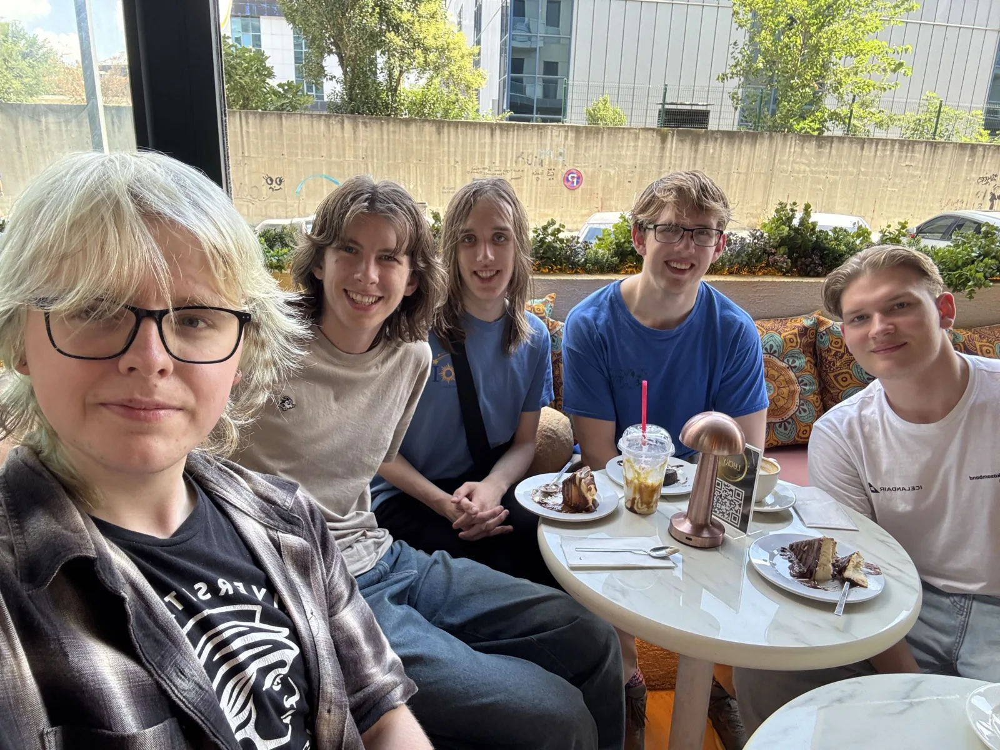
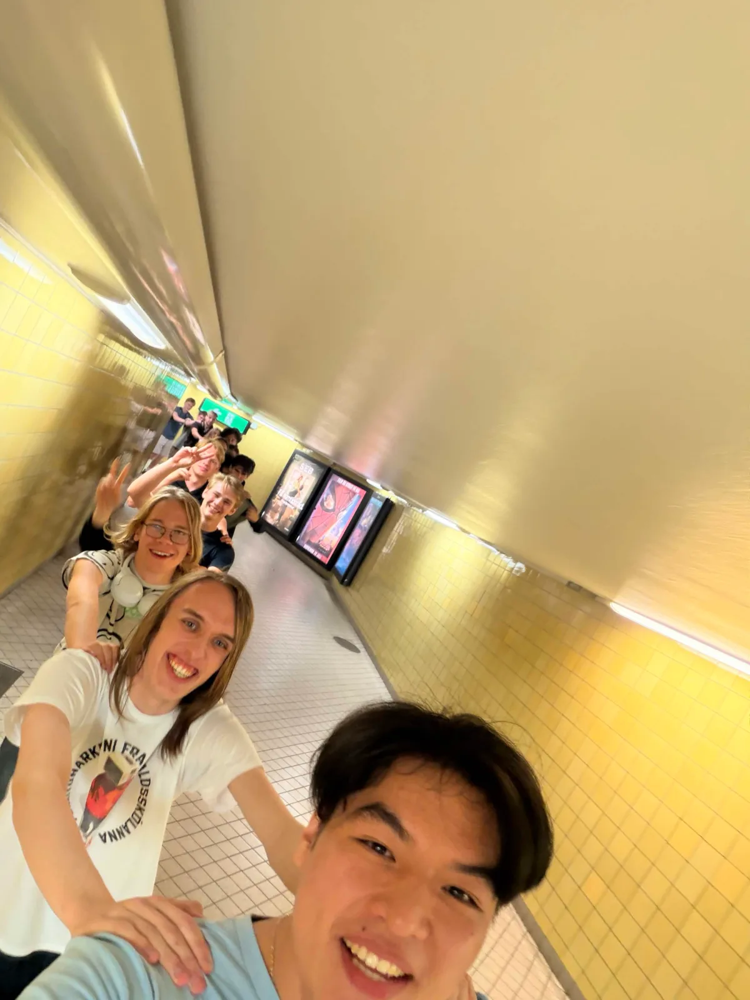
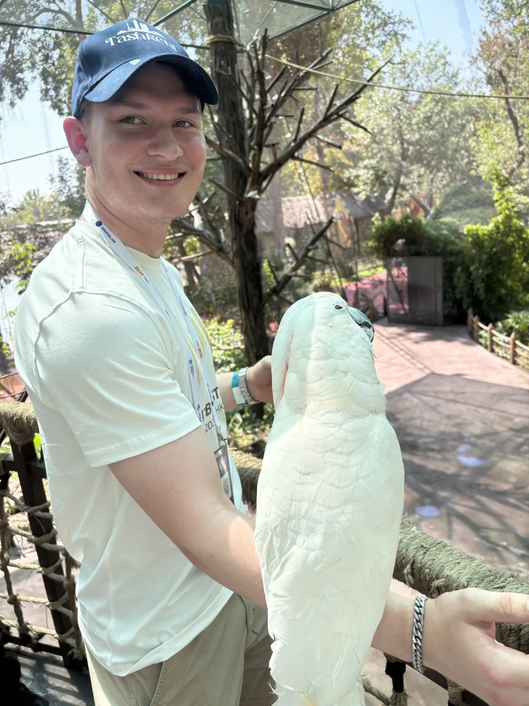
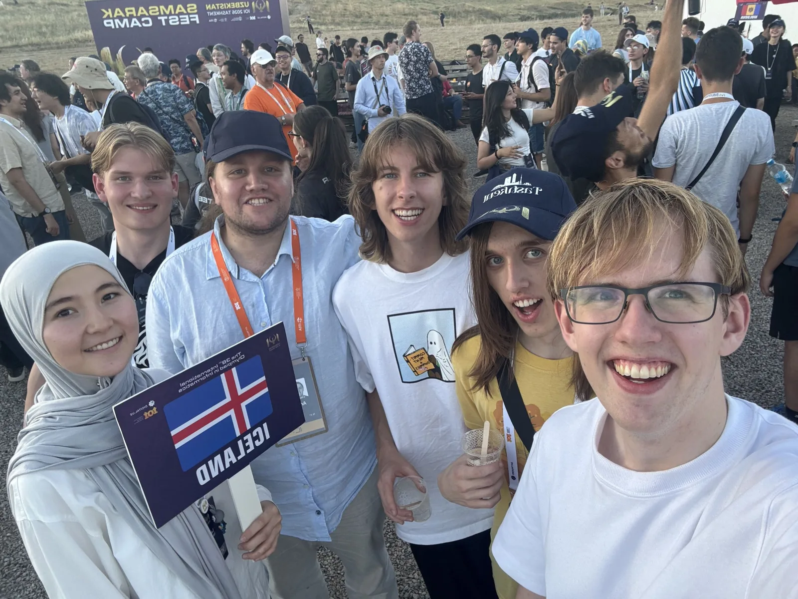

Keppnin IOI (International Olympiad in Informatics) 2026 var haldin 09. ágúst - 16. ágúst 2026 í Tashkent, Úsbekistan.

Í ár tóku þrír íslenskir framhaldsskólanema þátt í keppninni.
Keppnisforritunarfélag Íslands hélt æfingar á hverjum þriðjudegi og laugardegi með keppendunum og fleiri nemum, þar sem æfingarnar eru opnar öllum þeim sem hafa áhuga.

Ferðalagið byrjaði í Svíþjóð, þar sem íslenska liðið tók þátt í æfingabúðum með öðrum norðurlöndum.
Mikið fjör var í æfingabúðunum, þar sem keppendurnir okkar fengu að kynnast og taka æfingakeppnir saman með hinum þjóðunum.

Framhaldsskólanemarnir sem kepptu fyrir hönd Íslands voru:
- Eysteinn Daði Hjaltason, Verzlunarskóli Íslands
- Gunnsteinn Þór Ólason, Tækniskólinn
- Merkúr Máni Hermannsson, Menntaskólinn í Reykjavík

Samúel Arnar Hafsteinsson, liðsstjóri, og Kristinn Hrafn Daníelsson, aðstoðarliðsstjóri, fylgdu nemendunum á keppnina.
Arnar Bjarni Arnarsson hitti liðið úti þar sem hann sat í alþjóðanefnd keppnarinnar.

Gunnsteinn Þór náði flestum stigum af íslensku keppendunum, 220.40 stig samtals og hlaut einnig viðurkenningu fyrir góðan árangur þar sem hann var í efri hluta keppenda á keppnisdegi tvö.
Eysteinn Daði fékk 141 og Merkúr Máni fékk 122 stig.
Við erum ótrúlega stolt af frammistöðu keppanda okkar í ár og stefnum enn þá lengra á því næsta.

Keppendum var boðið í dýragarð í Tashkent, í bíó,  og lokahóf á flugdrekahátíð í Samsarak þar sem mikið fjör var að finna.

<figure>
    
    <figcaption>Frá vinstri: Merkúr Máni, Kristinn Hrafn, Gunnsteinn Þór, Samúel Arnar, Eysteinn Daði</figcaption>
</figure>

<figure>
    
    <figcaption>Kongaröð með norðurlöndunum í æfingabúðunum</figcaption>
</figure>

<figure>
    
    <figcaption>Eysteinn fékk heimsókn frá páfagauki í dýragarðinum</figcaption>
</figure>

<figure>
    
    <figcaption>Liðið ásamt Laziza, leiðsögukonunni sem passaði upp á okkur</figcaption>
</figure>

Hlekkir:
- [Heimasíða IOI 2026](https://ioi2026.uz)
- [Stigatafla](https://stats.ioinformatics.org/results/2026)
- [Verkefni](https://ioi2026.uz/tasks)
